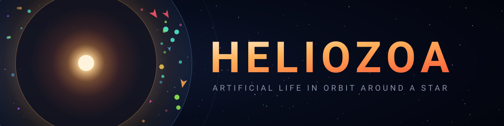
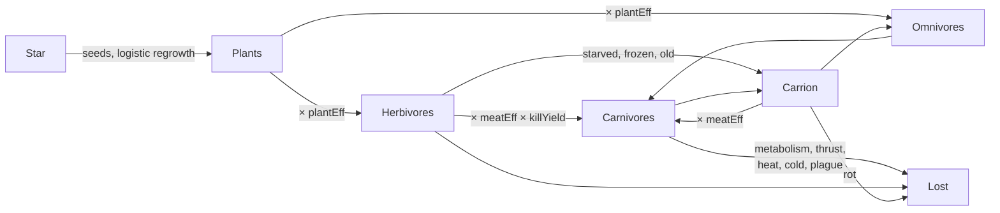

<div align="center">



# Heliozoa

**Nineteen numbers, one star, and no plan.**

[](https://github.com/ericmann/helioza/actions/workflows/test.yml)
[](LICENSE)
[](https://helioza.eamann.com)

</div>

Heliozoa is an artificial-life sandbox that runs in a browser tab. Simple
organisms orbit a star. Gravity pulls them in, light drag decays their orbits,
and staying in the habitable band costs energy they have to find somewhere. They
eat plants, or each other, or both badly. They mate with things they recognise
as relatives, catch plagues from things with similar immune systems, hide in
dark clouds, and curl up into dormant cysts when the food runs out. Nobody told
them to do any of this. They have nineteen floating-point genes and a weighted
sum of steering drives, and everything else is consequence.

There is no neural network here and no fitness function. There is a star, a
budget, and a great many ways to spend it wrong.

## Where it came from

In 2009 there was an iPod Touch app by Stormy Productions where little cells
swam around a light source and evolved, and it was quietly wonderful, and it has
been dead for well over a decade. This is that idea rebuilt from memory and then
extensively over-engineered by someone who could not leave it alone.

## Running it

No build step, no dependencies, no bundler. Point a static server at `public/`.

```
git clone https://github.com/ericmann/helioza.git
cd helioza
npx serve public
```

Or just open [helioza.eamann.com](https://helioza.eamann.com) and skip the
ceremony. Add `?seed=12345` to replay an exact run. Click an organism to read
its genome, shift-click to smite it, click empty space to drop a plant. The
sliders on the right change the world underneath the things living in it, which
is as rude as it sounds.

For tests, the headless harness, and the equivalence check that keeps this
honest, see [docs/development.md](docs/development.md).

## The genome

| Gene | Range | What it buys, and what it costs |
| --- | --- | --- |
| `size` | 0 – 1 | Radius, energy capacity, and reach up the predation ladder. Costs metabolism as the square, and cooks faster near the star. |
| `speed` | 0 – 1 | Thrust. Every unit of thrust is energy that came out of a meal. |
| `sense` | 0 – 1 | Perception radius, 30 to 180 units. Costs upkeep whether or not it sees anything. |
| `aggression` | 0 – 1 | Attack damage. Under 0.45 it never attacks at all, and still pays the upkeep. |
| `armor` | 0 – 1 | Subtracts flat damage from every bite. Costs more upkeep per point than sense or aggression. |
| `hue` | 0 – 1 | Colour. Purely cosmetic, and therefore free to drift, which is exactly why it makes such a good family name. |
| `foodDrive` | 0 – 1 | Pull toward the nearest thing it can digest, scaled by how hungry it is. |
| `kinDrive` | −1 – +1 | Toward relatives, or away from them. |
| `strangerDrive` | −1 – +1 | Toward strangers, or away from them. |
| `orbitRadius` | 0 – 1 | Preferred distance from the star. The range runs wider than the habitable band, so preferring somewhere lethal is a genome the population has to select against. |
| `orbitHold` | 0 – 1 | How stubbornly it defends that radius against gravity and drag. |
| `mateDrive` | 0 – 1 | How full it wants to be before it breeds. |
| `hideDrive` | 0 – 1 | Pull toward a hiding spot. Stronger when fed, stronger again when something large is nearby. |
| `marker1` | 0 – 1 | A neutral recognition marker. Does nothing else. |
| `marker2` | 0 – 1 | Another one. |
| `diet` | 0 – 1 | Herbivore to carnivore, continuously. Digestion is concave, so the middle is worse at both than either end is at one. |
| `kinTolerance` | 0 – 1 | Under 0.5, a starving organism will eat its own family. |
| `fear` | 0 – 1 | How hard it runs from something bigger. |
| `immune` | 0 – 1 | Immune type. Plagues cross between similar types, which makes a monoculture a liability. |

Kinship is judged on hue, the two markers, and diet. Two of those four do
nothing, so lineages can drift apart in recognition space without changing
strategy at all — and because diet counts, two populations that specialise on
different food stop recognising each other and stop interbreeding. Speciation
falls out for free. Nothing in the code knows what a species is.

## Where the energy goes



Every arrow into a mouth is lossy and every arrow out is not. The star is the
only thing putting anything in.

## Things you will see

**The founder crash.** Ten families of twelve start in a world with sixty
plants, which is nowhere near enough. The population overshoots, eats the
meadow, and most of the founding lineages are gone inside a few thousand ticks.
About a third of seeds go extinct outright, usually somewhere near tick 12,000.
Whatever crawls out of that is what actually evolves, and it is usually one
lineage with a bad haircut.

**Wolves eating every rabbit.** A carnivore lineage does well, breeds, does
better, and clears the map of anything smaller than itself. Then it looks around.
The satiation rule — a predator over 70% full stops hunting — is the only thing
standing between the ecology and this outcome on a fixed schedule, and it does
not always hold.

**Elephants.** Size buys energy capacity, armor, and immunity from everything
smaller, and it costs metabolism as the square. That trade is comfortably worth
it right up until the plants thin out, at which point an entire population of
enormous, well-armored, extremely slow organisms starves to death in unison.

**The cyst free lunch.** A starving organism can settle into a stable orbit and
go dormant, waking when there is food again. The first version let it wake with
everything it went in with, which made the optimal strategy: eat, encyst, skip
the famine, hatch, repeat, never pay metabolism again. Dormancy now costs 15%,
and an organism only gets one. Evolution found the hole without being asked to
look for it, and was not subtle about exploiting it.

## Documentation

- [docs/design.md](docs/design.md) — every mechanic, the reasoning behind each
  constant, and the levers worth pulling
- [docs/development.md](docs/development.md) — tests, the headless harness, and
  the equivalence check
- [docs/deployment.md](docs/deployment.md) — Cloudflare Pages
- [docs/notes.md](docs/notes.md) — suspected bugs, left alone on purpose

## License

MIT. See [LICENSE](LICENSE).

---

Watch it long enough and you will catch yourself rooting for a number.
