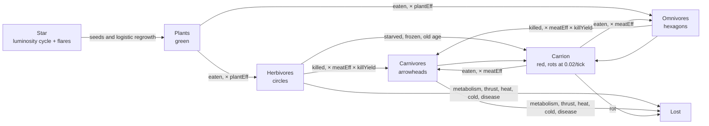
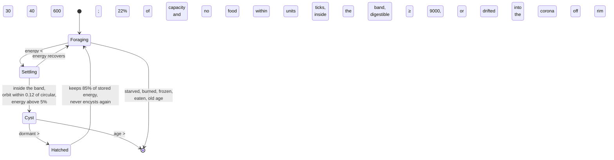
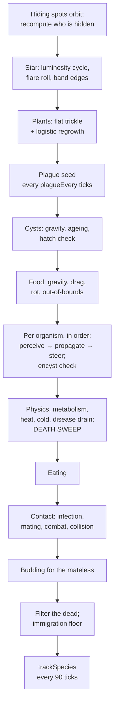

# Design

Every mechanic in Heliozoa, why it is there, and what happens if you change it.
Where the reason is recorded in the code or recoverable from the constants, it
is stated. Where it is not, this document says so instead of inventing one.

The whole simulation lives in five modules with no DOM dependency:
`config.js`, `rng.js`, `genome.js`, `organism.js`, `world.js`. The presentation
lives in `render.js`, `chart.js`, `ui.js`, `main.js`. Nothing in the first group
imports anything from the second.

## The world

A star sits at the origin. Everything else orbits it.

| Radius | Constant | What happens there |
| --- | --- | --- |
| 0 – 38 | `coronaR` | Instant death. No carrion; the star takes it. |
| 38 – 130 | `innerR` | Heat damage, scaling up as you approach the corona. |
| 130 – 330 | `innerR`–`outerR` | The habitable band. Nothing hurts you here. |
| 330 – 470 | `outerR`–`worldR` | Cold damage, scaling up toward the rim. |
| beyond 500 | | Frozen and gone. |

Gravity is `a = gravity / r²`, capped at `gravityCap` so that a body that falls
too close does not acquire an unbounded acceleration and tunnel through the star
in a single tick. The cap binds inside `r ≈ 65`, which is already inside the
heat zone, so in practice it only matters to things that are dying anyway.

`drag` decays velocity by a fixed fraction each tick. This is the single most
important constant in the file. Without it an organism could establish a
circular orbit once and coast forever, and the entire energy economy would
collapse into free real estate. With it, holding a position costs thrust, thrust
costs energy, and energy has to come from somewhere. The habitable band is not a
safe place to sit; it is a place you have to keep paying to stay in.

The star's output cycles on a `solarPeriod` sine wave of amplitude
`solarAmplitude`, and throws a flare with probability `flareChance` per tick
(suppressed for the first 2,000 ticks, so a founding population is not wiped out
before it establishes). The band's edges are scaled by the square root of
luminosity, which is the physically-shaped choice: radiant flux falls off as
`1/r²`, so an equal-temperature radius moves as `√L`. The band breathes in and
out by roughly ±11% on the cycle and lurches outward during a flare.

Both edges move together, which means a flare is not a uniform disaster. It
cooks anything hugging the inner edge and rescues anything that was freezing on
the rim.

## Energy



Plants arrive two ways. A flat `foodRate` trickle represents seeds blowing in
from outside, and a logistic term
`plantGrowth × n × (1 − n / foodCap)` grows the standing crop from itself. The
logistic term is what makes overgrazing punishing: a herd that eats a meadow
down to nothing does not get it back at the same rate, because there is nothing
left to regrow from. Recovery then depends entirely on the trickle, which is
slow on purpose. The flat term exists so that a fully grazed world is not
permanently dead — without it, `n = 0` is an absorbing state.

Plant growth peaks at half the cap. This is the standard logistic shape and it
means the food supply has a natural target: graze it to half and it feeds you
fastest. Nothing in the simulation knows that, which is the point.

Carrion is created by every death except three: `burned` and `smitten` (the star
or the user's finger took the body) and `eaten` (the predator did). Its energy
is `20 + 50 × size + half of whatever the organism had left`, and it rots at
`0.02` per tick, so a mid-sized body is gone in something over two thousand
ticks if nothing finds it. The code comments record that carrion rots but not
why; the obvious reading is that without rot, a mass die-off leaves a permanent
food store and the boom-bust cycle flattens out.

## The genome

Nineteen floats in `[0, 1]`. Behaviour is a weighted vector sum of steering
drives, not a network — every gene below either scales a drive or a derived
trait, and you can read an organism's whole strategy off the inspector.

| Gene | Bipolar | What it does |
| --- | --- | --- |
| `size` | | Radius `3 + 6g`, energy capacity, metabolic cost `0.05g²`, heat vulnerability, cold resistance, and where it sits on the predation ladder. |
| `speed` | | Thrust `(0.003 + 0.02g) × (1.1 − 0.3 size)`. Thrust costs energy every time it is used. |
| `sense` | | Perception radius `30 + 150g`. Costs `0.010g` upkeep per tick. |
| `aggression` | | Attack damage. Below `0.45` it never attacks at all. Costs `0.008g` upkeep. |
| `armor` | | Subtracts `6g` from incoming damage. Costs `0.012g` upkeep. |
| `hue` | | Colour only. Drifts freely under mutation, which makes it the clearest visual marker of a lineage. Counts toward kinship. |
| `foodDrive` | | Pull toward the nearest edible food, scaled by hunger. |
| `kinDrive` | yes | Toward (+) or away from (−) relatives. |
| `strangerDrive` | yes | Toward (+) or away from (−) non-relatives. |
| `orbitRadius` | | Preferred distance from the star, mapped onto `97.5` to `369.6` — deliberately wider than the band, so preferring a lethal orbit is a genome the population has to select against. |
| `orbitHold` | | How hard it steers back to that radius. Overridden to `1.6` near the corona or the rim, so nothing evolves its way into the star. |
| `mateDrive` | | Energy fraction at which it will breed: `maxEnergy × (0.35 + 0.6g)`. |
| `hideDrive` | | Pull toward a hiding spot, stronger when fed and stronger again when threatened. |
| `marker1` | | Neutral recognition marker. Does nothing except count toward kinship. |
| `marker2` | | The same. |
| `diet` | | `0` pure herbivore, `1` pure carnivore. Sets `plantEff = (1 − g)^1.7` and `meatEff = g^1.7`. Counts toward kinship. |
| `kinTolerance` | | Below `0.5`, a starving organism will hunt its own relatives. |
| `fear` | | Strength of the flee response to a larger predator within 80 units. |
| `immune` | | Immune type. Disease crosses between organisms whose types are within `immuneMatch`. |

### Why digestion is concave

`plantEff` and `meatEff` are both raised to the power `1.7`, so an omnivore at
`diet = 0.5` digests plants at `0.308` and meat at `0.308` — worse at both than a
specialist is at one. The exponent is the mechanism that makes the middle of the
diet axis a bad place to be, and it is what turns a continuous gene into two
discrete strategies.

The perception loop and the eating loop both ignore food with an efficiency
under `0.15`, which draws a hard line: past `diet ≈ 0.672` an organism cannot
see a plant at all, and below `diet ≈ 0.328` it cannot see a corpse. Those are
almost exactly the `0.33` and `0.67` boundaries the sidebar uses to label
herbivores, omnivores and carnivores, which is a pleasing coincidence and may
not be one. Those two blindnesses, plus kinship counting diet, are the whole
speciation mechanism.
Diverging diets stop recognising each other, stop interbreeding, and become
separate species without any explicit species concept in the code.

### Kinship

Kinship is the mean absolute difference over exactly four genes — `hue`,
`marker1`, `marker2`, `diet` — against `kinThreshold`. Two of those four are
neutral markers that do nothing else, which is the point: they let lineages
drift apart in recognition space without any change in strategy, the way real
species barriers accumulate from junk. Kinship gates mating, predation
(`kinTolerance`), and the `kinDrive` steering term.

Species in the sidebar are single-linkage clusters on that same distance, with
ids carried forward by matching each cluster to whichever previous id most of
its members already hold, largest cluster first. So when a lineage splits, the
larger remnant keeps the name and the splinter gets a new one.

## Reproduction

Sexual by default: uniform crossover, then per-gene mutation at `mutationRate`,
each mutation either a Gaussian nudge of `mutationSigma` or, with probability
`bigMutation`, a complete re-roll. The rare full re-roll is there so the
population can cross a valley it could not walk across — small mutations alone
get stuck on a local peak and stay there.

Both parents pay `mateCost` of their current energy, and the child starts with
the sum. Then `mateCooldown` ticks before either can breed again.

Budding is the fallback. An organism that has been mature, fed, off cooldown and
without a partner for `budAfter` consecutive ticks clones itself for `budCost`
of its energy. This exists because the founder crash — see below — regularly
strands single survivors, and without asexual reproduction a lineage of one is a
lineage of zero.

### The Baldwin term

After crossover and mutation, the child's diet gene is pulled toward what its
parents actually ate:

```
child.diet += dietAssimilation × (realizedDiet − child.diet) × random()
```

The random factor means the pull is somewhere between nothing and
`dietAssimilation`, never the whole way, so a child never overshoots past its
parents' realized diet. This is genetic assimilation: behaviour that an organism
learned to get away with, because the food happened to be there, biases what its
offspring are born with. Turn `dietAssimilation` to zero in the sidebar and diet
evolves by mutation alone, which is markedly slower to split the population.

## Predation

An organism can hunt at all if `aggression > 0.45` and `meatEff > 0.3`. Whether
it actually is hunting right now is a persistent, hysteretic state — `o.hunting`
— not a per-tick recomputation. It switches on once energy falls below
`huntStart` (60% of capacity) and stays on until energy climbs back above
`huntStop` (75%). The gap between the two thresholds is deliberate: a predator
sitting exactly at the boundary does not flicker in and out of hunting mode
every other tick the way a single cutoff would make it. `huntStop` is well
short of full for a second reason, covered below.

A target persists once acquired, instead of being re-picked from scratch every
tick. `o.prey` survives across ticks and is only dropped when it dies, goes
hidden, grows past the size ladder, drifts beyond `huntLeash × senseR`, the
chase has run longer than `huntGiveUp` ticks with nothing to show for it, or the
predator stops hunting. A predator that gives it up while the prey is still
alive remembers that target as `avoidId` for `huntRest` ticks — it will not
immediately re-acquire the exact same animal it just failed to catch.

While a target is held, a new candidate only replaces it if the candidate's
score is below `targetSwitch` (60%) of the current target's score — otherwise a
predator would spend its whole chase budget re-optimizing between two prey of
nearly equal quality and catch neither. The score itself is
`distance² × (1 + armorAversion × armor) × (herdN === 0 ? stragglerBias : 1)`:
armour makes a candidate look farther away than it is, and having no herd
nearby (see Herding, below) makes it look closer. A predator picks off the
animal that wandered off from the group rather than wading into the herd for
one that is better defended — not because it reasons about it, but because that
animal scores lower.

Pursuit aims at where the prey will be, not where it is: `lead` (0.8) times a
time-to-intercept estimate, capped at `leadMax` ticks. It will attack anything
up to `preyRatio` (1.1) times its own radius, so slightly larger prey is on the
menu, but damage carries `(att.r / def.r)^2.5`, which falls off steeply —
attacking upward is allowed and almost never works. Relatives are off the menu
unless the attacker is starving *and* has `kinTolerance < 0.5`.

Damage per contact tick is
`(aggression − 0.3) × 12 × (0.5 + r/8) × sizeAdvantage − armor × 6`, tuned so a
kill takes a handful of contact ticks rather than a siege. A chase that lasts
long enough for the prey to break away should be possible; a stalemate where two
organisms grind at each other for a thousand ticks should not.

Sprinting multiplies thrust and speed cap by `sprint` while hunting and within
140 units of the current target, at 1.6× the energy cost. It is what makes a
hunt a commitment: a predator that sprints and misses is worse off than one
that never tried.

The meal is `(victim's energy × killYield + 25 + 70 × victim size) × meatEff`.
The body is worth something on its own, so killing a starving organism is still
worth doing, and a fat one is worth much more.

### Why `huntStop` sits at 75%, not 90%

It was 90% originally, matching the old single-threshold satiation rule this
replaced. At 90%, a predator with a run of easy kills barely ever stops
hunting, and a population of them sustains a kill rate the prey population
cannot outbreed. The 24-seed sweep below shows what that did: several seeds
that used to end with a stable mixed population instead ran their carnivores up
past twenty individuals on an abundant herd, stripped it in a few thousand
ticks, and collapsed the whole food web behind them — predators included, once
there was nothing left to eat. Stopping at 75% leaves real appetite while
capping how long a well-fed predator keeps adding to the kill count.

## Herding

Every relative within `herdR` (55 units) of an organism counts as the same
herd, computed fresh each tick in `perceive()` alongside its nearest kin, food
and threat. `steer()` turns that into three forces, all scaled by the bipolar
`kinDrive` gene (`herdW = kinDrive × 2 − 1`):

- **Cohesion** — a pull toward the herd's centroid, weight `herdW × cohesion`,
  doubled while the herd is fleeing (see Group flight). A loner-leaning genome
  (`herdW < 0`) gets pushed *away* from its own herd by this same term.
- **Alignment** — for `herdW > 0` only, a pull to match the herd's average
  velocity. A loner does not bother matching anyone's heading.
- **Separation** — an unconditional push away from any herd-mate closer than
  `(ra + rb) × sepFactor`, regardless of `kinDrive`. This is personal space, not
  a social preference; without it cohesion alone would collapse a herd onto a
  single point.

An organism with no relatives inside `herdR` is not in a herd and falls back to
the pull this replaced: straight toward its single nearest kin, whatever the
distance out to `senseR`. That is what brings a straggler back to the group,
and it is the same formula the whole population used before herding existed.

Herds sharing a preferred orbit graze one patch of the band down and drift
together to the next. That is local overgrazing, and it is a consequence of
cohesion working as intended, not something to correct.

## Group flight and guarding

A stranger is only a threat if it is actually hunting (`p.hunting`, see
Predation) — a fed predator does not trigger anyone's flee response. Perceiving
a threat and reacting to it are two different fields: `ownThreat` is what an
organism personally sees; `threat` is what it is reacting to, which may be
adopted from a relative.

That adoption is one hop, computed in `propagate()` right after perception, before
anyone moves: an organism with no `ownThreat` of its own looks at its herd and
takes the first `ownThreat` it finds there, marking itself `alarmed`. It does
*not* look at a relative's already-adopted `threat` — only at `ownThreat` — so
alarm cannot leapfrog across a whole herd in one tick; it moves outward one
relative at a time, tick by tick, the way it would if this were a literal
"something spooked, now I'm spooked" reaction passed along a chain.

An organism is `threatened` — the state that actually drives flight — once the
threat is within `alarmR` (90 units) of *either* itself or, for a herd member,
the herd's centroid. That second clause is what makes the far side of a herd
flee before the predator is anywhere near it: it reacts to the herd's exposure,
not just its own.

While threatened, an armoured member of a big-enough herd
(`herdN >= guardMinHerd` and `armor >= guardArmor`) becomes a guard: instead of
running, it takes station on the flank between the herd's centroid and the
threat, `herdR × 0.4` out, and only leans away from the threat at 30% of the
normal flee strength. Nothing else is needed to make this read as "the armoured
protect the weak" — the guard is physically between the predator and the herd,
its armour makes the predator's straggler scoring avoid it anyway, and if the
predator closes in regardless, the existing armour term in combat damage does
the rest. Every other threatened member flees the threat directly, at full
`fear` strength, plus a pull to the herd's *far* side — away from both the
threat and, usually, past where the guard is standing.

### Packs

The same one-hop adoption used for alarm also shares a hunt: in `propagate()`,
a hunting organism with no `prey` of its own looks at its herd for a relative
that is hunting *and* already has one, and takes the same target. This is the
whole mechanism — there is no coordination beyond it, no flanking, and no
signal that a hunt has started rather than just being sensed. Whether pack
hunting evolves is left entirely to selection: it depends on carnivore
`kinDrive` staying positive, which competition over a kill does not obviously
favour. If it turns out no seed ever produces one, that is a legitimate result,
not a bug.

## Hiding spots

Seven dark clouds orbit without drag. Inside one, an organism cannot be attacked,
cannot eat, and pays half metabolism — but can still mate. That combination makes
them a real strategic choice rather than a free win: a hiding spot is where you
go to wait out a predator or to breed in peace, and it is where you starve if
you stay.

The `hideDrive` gene is scaled by `1.3 − hunger`, so a fed organism seeks cover
and a hungry one does not. Being `threatened` (see Group flight and guarding)
multiplies the pull by 1.8 — including when the threat was only heard about
through a relative, not seen directly.

## Disease

Every `plagueEvery` ticks, if the population is over 40, one organism is
infected for `plagueLength` ticks. It loses `plagueDrain` energy per tick and
spreads on contact with probability `plagueSpread`, but only to organisms whose
`immune` gene is within `immuneMatch`. Survivors are marked `recovered` and
cannot be reinfected.

The immune-similarity gate is what makes the plague interesting rather than
merely annoying. A genetically uniform population — exactly what you get after a
founder crash — is a monoculture, and the plague tears through it. A diverse one
loses a few individuals. The mechanic selects for variance in a gene that does
nothing else.

## Encysting



A starving organism with nothing in reach stops steering toward anything and
aims for a stable circular orbit in the middle of the band. Once it gets there —
inside the band, orbit within `0.12` of circular, still holding at least 5% of
its capacity — it becomes a cyst: dormant, gravity-bound, invisible to
predators, spending nothing. It wakes when there is enough food it can
personally digest, weighted by its own `plantEff` and `meatEff`, so a
carnivore's cyst is unmoved by a meadow.

This is the mechanic that lets a lineage survive a famine it could not survive
awake. It is also the one that needed the most patching. A cyst originally
hatched with its full stored energy, which made encysting a free way to skip a
famine at no cost; `cystHatchEnergy` now takes 15% as the price of dormancy. And
`hasEncysted` is set permanently, so an organism can only do it once — otherwise
the optimal strategy was to encyst, hatch, eat, encyst again, and never pay
metabolism at all. The comments do not record which of these was discovered
first, only that both are guarded now.

## Contact resolution order in `step()`

The order matters, and several of the quirks in [notes.md](notes.md) are
consequences of it.



The death sweep sits in the middle. Anything that spends energy after it —
notably the attacker's `0.4` per bite — can leave a live organism on negative
energy until the next tick's sweep catches it.

### `perceive → propagate → steer`

Step G is not three passes over the population; it is three methods called
back to back, once per organism, in `orgs` array order. `perceive()` reads the
world and every other organism's *current* position and does not mutate
anything but the organism doing the perceiving — it sets `nearFood`, `nearKin`,
`nearStranger`, `ownThreat`, the herd fields, and resolves that tick's hunting
target. `propagate()` is where an organism may adopt a herd-mate's `ownThreat`
(alarm) or `prey` (a pack target) — see Group flight and guarding, and Packs.
`steer()` turns all of it into thrust.

Because this runs one organism at a time instead of in three full sweeps, an
organism later in `orgs` has already-updated fields on any herd-mate processed
earlier in the array this tick, but only last tick's values from one processed
later. `herdN`, `ownThreat` and `prey` can all be up to one tick stale when read
this way. That staleness is accepted throughout rather than engineered away —
the alternative is three full passes over the population every tick for a
sandbox that already runs an O(n²) perception loop twice, and the effect is at
most a single tick of lag in something a viewer cannot perceive as a tick
count. `verify-faithful` no longer holds past the commit tagged
`faithful-to-original` for exactly this reason: this ordering, and the
deliberate hunting and herding changes built on it, are new behaviour, not a
refactor. See "Verifying a change to the core" in
[development.md](development.md).

## The tuning levers

Five of these are exposed as sidebar sliders because they are the ones worth
playing with while watching. The rest are in `config.js`.

| Lever | Default | What it does to the ecology |
| --- | --- | --- |
| `foodRate` | 0.05 | The seed trickle. The floor under a crashed food supply. Raise it and overgrazing stops mattering; drop it to zero and one bad grazing season is permanent. |
| `mutationRate` | 0.25 | Per-gene chance of mutating. High values dissolve species back into a smear; low values freeze whatever the founders happened to be. |
| `mateCost` | 0.30 | Fraction of each parent's energy paid to the child. Raise it and reproduction becomes a serious gamble; lower it and the population explodes and then overgrazes. |
| `drag` | 0.0003 | The cost of existing in orbit. The whole economy scales off this. Zero it and organisms coast forever and nothing has to work. |
| `dietAssimilation` | 0.35 | How strongly a child's diet follows what its parents ate. The speed control on speciation. |
| `plantGrowth` | 0.006 | Logistic regrowth rate. Sets how fast an overgrazed world comes back. |
| `foodCap` | 420 | Carrying capacity, and the peak of the growth curve at half of it. |
| `preyRatio` | 1.1 | How far up the size ladder a predator will reach. |
| `sprint` | 1.5 | Thrust and speed multiplier during a chase, at 1.6× the energy cost. It is the difference between a predator that can close a gap and one that merely follows. |
| `cystAt` | 0.22 | How desperate an organism has to be before it gives up and goes dormant. |
| `huntStart` / `huntStop` | 0.6 / 0.75 | The hysteresis band for hunting. Widen the gap and predators commit to longer hunting stretches between rests; push `huntStop` back toward 1 and you reintroduce the overshoot-and-collapse described above. |
| `cohesion` | 1.2 | Pull toward the herd's centroid. Raising it makes herding more visible but, per the 24-seed sweep, sometimes trades a healthy population for a tighter one — an unresolved tension between this and predation worth tuning further. |
| `herdR` | 55 | How close relatives have to be to count as the same herd rather than a lone straggler regrouping. |
| `alarmR` | 90 | How close a threat has to get, to the organism or its herd's centroid, before anyone actually flees. |
| `stragglerBias` / `armorAversion` | 0.5 / 2.0 | How strongly a predator prefers an unguarded, herdless target over a defended one at the same distance. |
| `immuneMatch` | 0.12 | How similar two immune types must be for a plague to cross. Wider values make monocultures lethal. |
| `founders` / `familySize` | 10 / 12 | The starting population, and how much standing variation it has. |
| `immigration` | off | God mode. Airlifts a new family whenever the population falls below `minPop`. Off by default because extinction is a legitimate result. |

## Things that were built to fix something

Several constants read as patches rather than choices. Where the code says why,
it is quoted. Where it does not, this section says what the constant *does* and
leaves the motivation alone — the tuning history is not in the repository.

- **Satiation on hunting.** Originally a single cutoff, `o.energy <
  o.maxEnergy * 0.7`, commented "satiated predators don't hunt". It is now the
  `huntStart`/`huntStop` hysteresis described under Predation, for the same
  reason a thermostat uses two temperatures and not one: a single threshold
  flickers when energy hovers near it. `huntStop` sitting at 75% rather than
  90% is itself a fix, not the original design — see "Why `huntStop` sits at
  75%, not 90%" under Predation.
- **Concave digestion.** The `1.7` exponent, commented "concave: specialists
  digest well, generalists pay for flexibility". The comment is explicit that
  the curve is deliberate. It does not record what a linear tradeoff produced.
- **Steep size advantage in combat.** `(att.r / def.r)^2.5`, commented "damage
  falls off steeply against bigger prey", alongside a `preyRatio` that lets a
  predator *try* for something 10% larger than itself. The two together are what
  make the size ladder a ladder rather than a free-for-all.
- **The hard-wired orbit reflex.** `hold = 1.6` when `r` is near the corona or
  past the rim, regardless of the `orbitHold` gene, commented as "a hard-wired
  survival reflex". A genome cannot evolve its way into the star.
- **Flares suppressed before tick 2,000.** `this.tick > 2000` on the flare roll,
  with no comment. Whatever the reason, the effect is that the founding
  population cannot be wiped out by a flare before it has bred.
- **`cystHatchEnergy` and `hasEncysted`.** Both close free-lunch exploits in
  dormancy, described above. The comments name the mechanism — "fraction of
  stored energy kept through dormancy" — but not the exploit.

## The founder crash

Not a mechanic, but the shape of nearly every run. Ten families of twelve start
in a world with sixty plants. The plants cannot regrow fast enough for 120
organisms, the population overshoots, the food crashes, and most of the founding
lineages die within the first few thousand ticks. Roughly a third of seeds go
extinct entirely, usually around tick 12,000. What comes out the other side is a
much smaller population descended from one or two lineages, and *that* is the
population that evolves.

Sweeping seeds 1 through 24 with `scripts/headless.mjs` at 30,000 ticks, seven
of the twenty-four went extinct — the same count as before hunting and herding
were added, though not always the same seeds or the same shape of collapse. Six
of the seven still die the classic way, in the first food crash, between tick
10,400 and 12,400. The seventh, seed 13, now makes it all the way to tick
29,320 — 860 births, four species, a real population — before a late-game
predation collapse takes the whole thing down in the run's last few hundred
ticks. That is a new failure mode this work introduced, not a bug: a herd that
was doing fine can still be run down faster than it can rebuild once enough of
it has been thinned. That is why the ecology test pins a seed. Seed 12 survives
with two species and a mixed diet, carnivores included, at every seed sweep run
against it in this repository's history so far. Seed 5 does not, and that is a
legitimate result rather than a bug.
